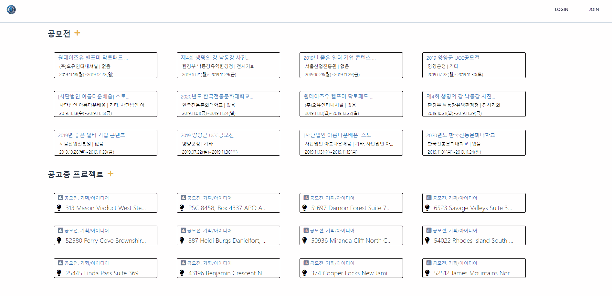
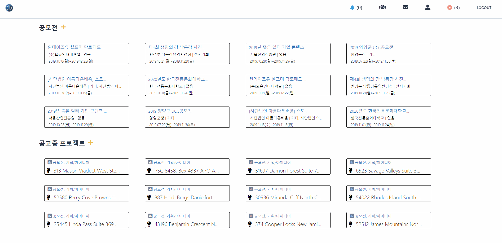
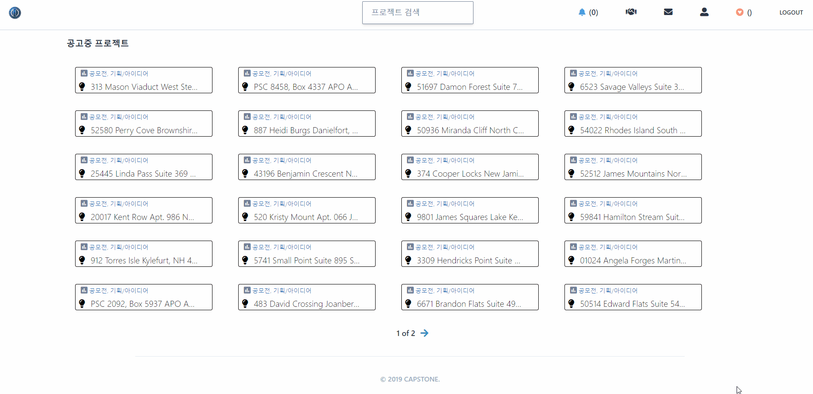
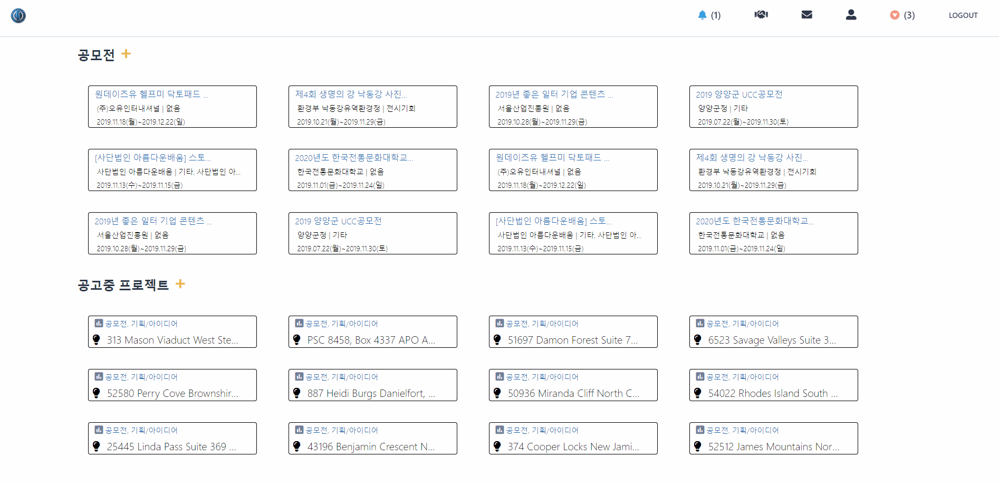
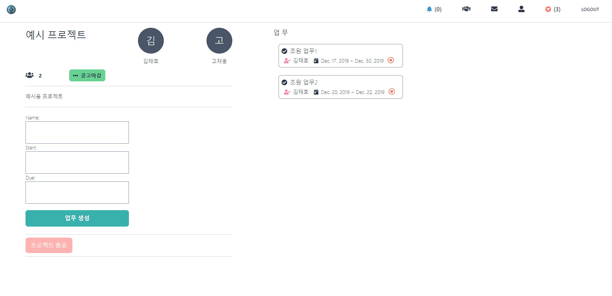
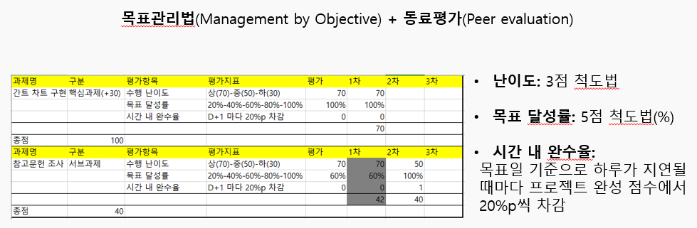

# HUFS CrewHelper

한국외대 학생들을 위한 공모전과 참가 할 학우들을 모집할 수 있는 플랫폼

### ENVIRONMENT
- Django2.2.7
- beautifulSoup
- TailWind CSS

```javascript
pipenv shell
python manage.py runserver
```

- 카카오톡, 이메일 로그인

- 웹스크래핑으로 가져온 실제 공모전 100여개, 인원모집 중 공고

- 해당 공모전 관련 프로젝트 생성 후 공고 (보여지는 프로젝트는 Django_seed의 fake data)

- 인원 모집중인 프로젝트에 참가 신청

- 조장에 의해 수락되어 참가 및 메세지 전송

- 조원 업무별 기한 및 기여도 평가


